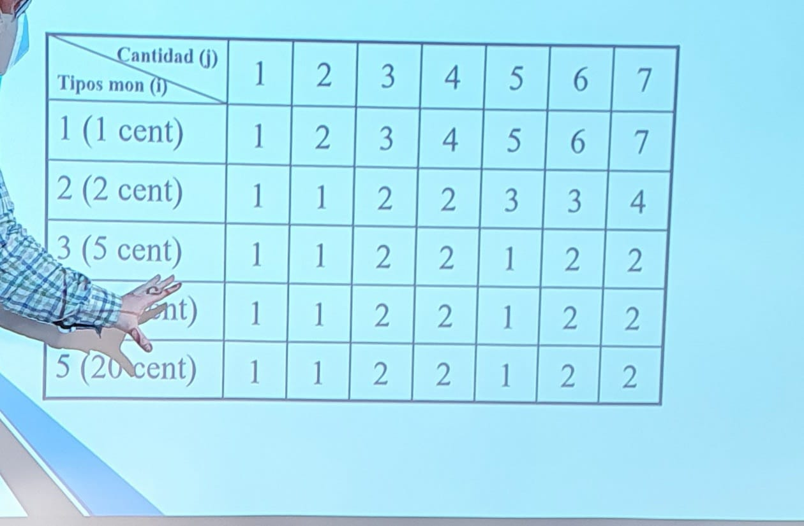
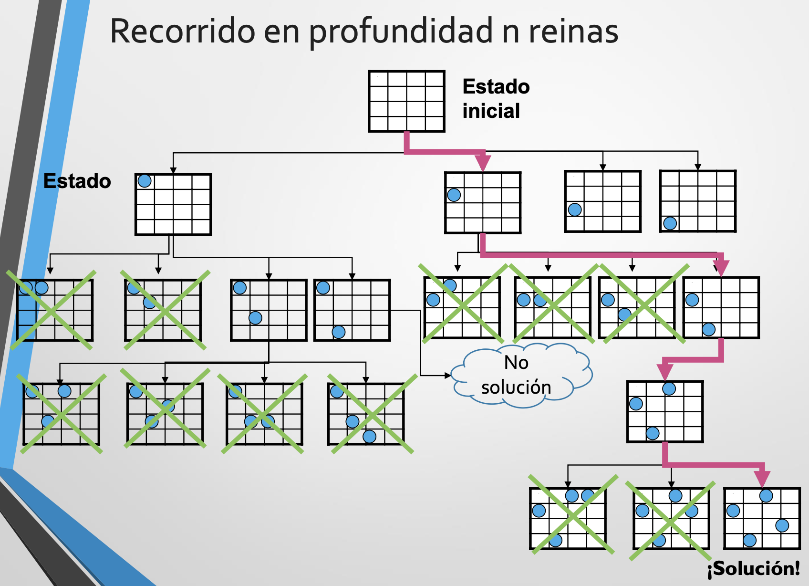
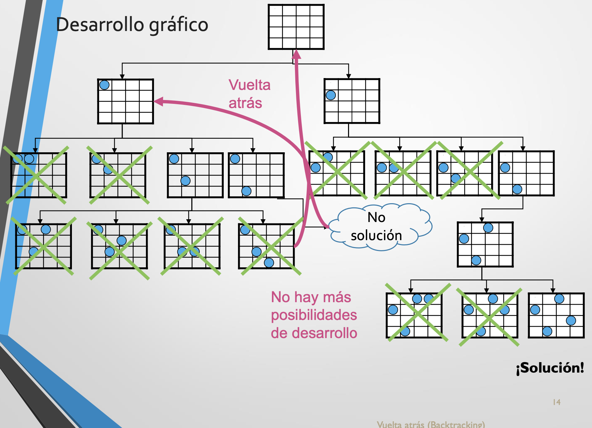
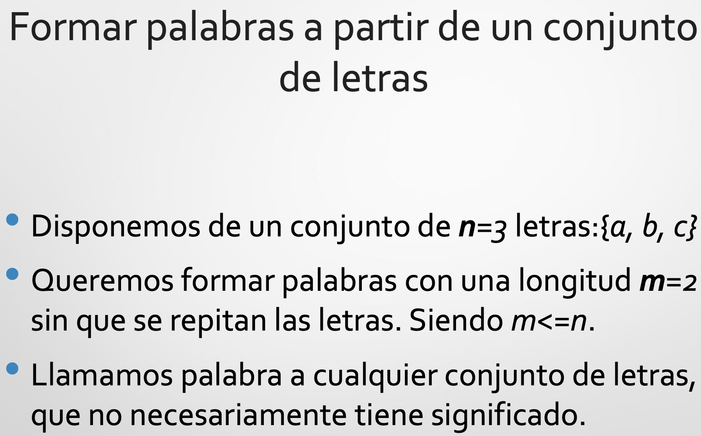
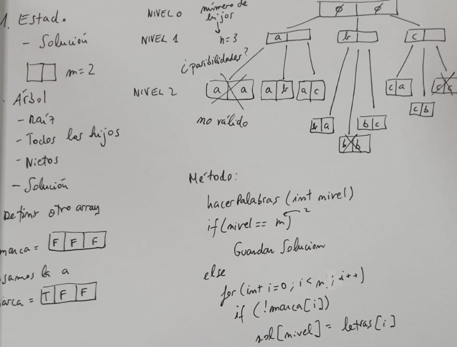
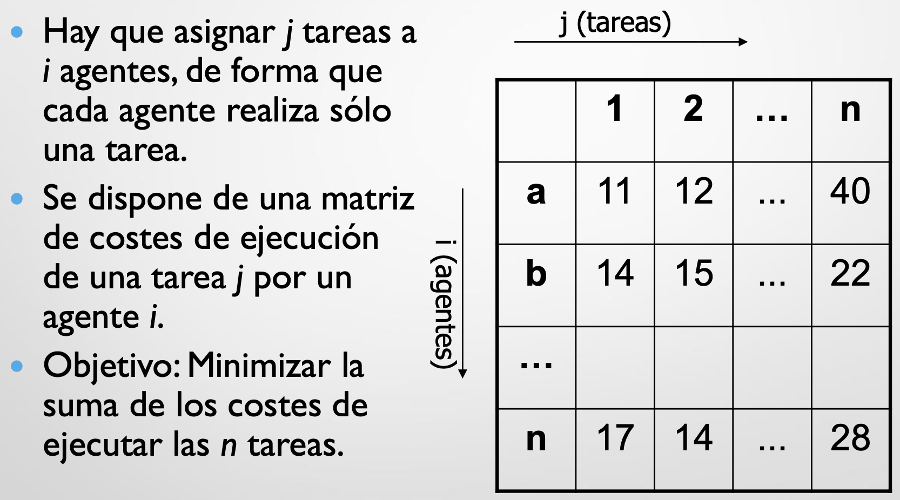

# 22 Marzo 2022 💈
---
## Programación dinámica
- Tenemos un array donde guardamos resultados intermedios para calcular el resultado final.
- Es un método iterativo, cuyo origen es una función recursiva. Sustituimos las llamadas recursiva por accesos a las posiciones del array.

- Se repiten operaciones, por tanto se guardan las calculadas en un array para no recalcularlas varias veces.
---
## Problema del cambio

Lo que no se ve son 10 céntimos :-)
- Buscar el mínimo para no pasarse, usando la moneda de la iteración o de iteraciones anteriores.
---
## Backtracking
- **Problema de las 8 reinas:** colocar 8 reinas en un tablero sin que se coman.
- **Backtracking** explora el grafo, va desarrollando estados hasta que encuentra una solución. Es un *algoritmo de fuerza bruta*, puesto que lo que hace es desarrollar estados de forma rápida hasta encontrar una solución.
- Técnica ineficiente, con complejidades exponenciales.

- **Grafo implícito:** grafo que se desarrolla a medida que se va recorriendo. Ahorra tiempo de ejecución y espacio en memoria.


#### Esquema Backtracking
```java
 

public static void backtracking(Estado e) {

	if (e.esSolucion()) { System.out.println(e); haySolucion= true;

	}  
	else {

		Estado estadoHijo= null; 
		while(e.hasNextHijos() && !haySolucion) {
		// siguiente estado hijo válido 
			estadoHijo= e.nextHijo(); 
			
			if (estadoHijo!=null) // puede que no queden hijos válidos backtracking(estadoHijo);
		}


} }
```
---
# 29 Marzo 2022 🗿
---
- Backtracking busca todas las soluciones posibles.
- También se puede buscar la solución óptima.
---
## Poda de nodos
- Consiste en establecer una condición que impida seguir desarrollando nodos aunque sean válidos.
- Se aplica cuando tenemos que buscar una solución óptima.
- Backtracking tiene complejidad explonencial.
---
### Ejercicio formar palabras a partir de un conjunto de letras


```java
 public static void backtracking (int nivel) {

	if (nivel==m) //hay ya una palabra completa {

		mostrarSolucion();

		cont++; 
	}

	else  {
		for (int i=0;i<n;i++){

			if (!marca[i]) {

				sol[nivel] =vLetras[i]; 
				marca[i]=true; 
				backtracking(nivel+1); 
				marca[i]=false;
			}
		}
	}

}
```
---
### Problema de la asignación de tareas a agentes


```java
 static void backtracking (int nivel) {  
	if (nivel==n) { //hay ya una asignación completa

		if (coste<costeMejor) { 
			for (int k=0;k<n;k++){
				 asigMejor[k]=asig[k];
			costeMejor=coste; 
			}
		} }

	else {  
		for (int i=0;i<n;i++){

			if (!marca[i] && coste<costeMejor ) //ostemMejor->poda
				asig[nivel]=i;
				coste=coste+w[nivel][i]; 
			    marca[i]=true; 
			    backtracking(nivel+1); 
			    coste=coste-w[nivel][i]; 
				marca[i]=false;
		}

	} 
}
```
- Se podría hacer una poda (costemejor).
---
# 5 Abril 2022 🔵
---
- Aplicamos la poda en los problemas de optimización.
### Problema del salto del caballo
```java
 static void backtracking (int salto,int x,int y) {  
	if (salto==n*n+1) { // ya acabó de recorrer tablero

	seEncontro=true;

	mostrarSolucion(); }

	else  
		for (int k=0;k<=7;k++) {

			int u=x+h[k]; // nueva posición 
			int v=y+v[k];

		if (!seEncontro &&  
			u>=0 && u<=n-1 && v>=0 && v<=n-1 && // dentro tablero       
			tab[u][v]==0) { // casilla no utilizada
			tab[u][v]=salto; 
			backtracking (salto+1,u,v); 
			tab[u][v]=0;

}

} }

```
---
# Tema 7, Ramificación y poda 🔊
---
- No hace falta tener una asignación secuencial.
- Backtracking es recursivo, mientras que poda es iterativo.
```java
 public void realizarAnchura(Estado e) {

	Cola cola= new Cola(); // Cola FIFO (1o en entrar --> 1o en salir) 
	boolean haySolucion= false; // Para buscar la primera solución Estado actual; 
	Estado actual;

	cola.insertar(e); // mete estado e en la cola 
	while (!cola.esVacia() && !haySolucion)  {

		actual= cola.extraer();  
		// Examinar todos los hijos del estado actual 
		for (Estado estadoHijo : actual.expandir())  {

			if (estadoHijo.esSolucion()) 
				haySolucion= true;

			else
				 cola.insertar(estadoHijo);
		}

} }
```
Diferencias de poda con backtracking:
- Desarrollo de los nodos en anchura.
- Aplicamos heuristico para seleccionar cuál de ellos vamos a desarrollar.


MALA FORMA, sirve para hallar una solución. Para hallar la solución óptima es malo.


---
# 19 Abril 2022 ⏰
---
- El heurístico de ramificación permite saber los nodos que llevan a la solución final
- El heurístico de poda permite ir eliminando aquellos nodos que superen la cota.
