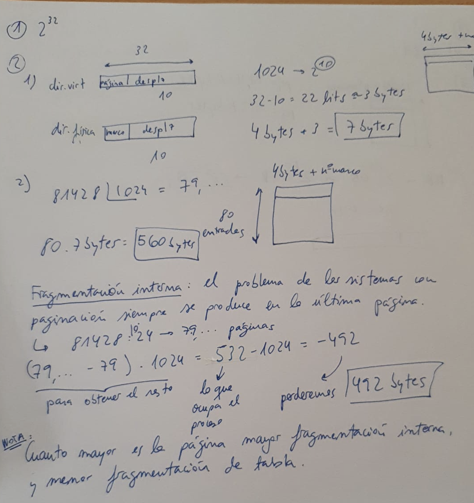
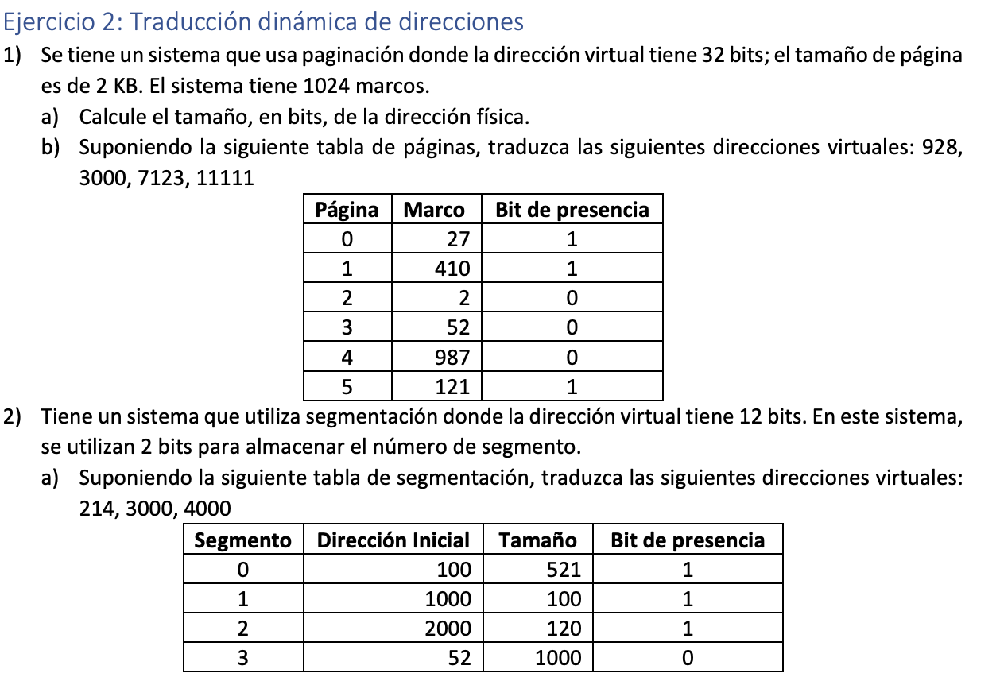
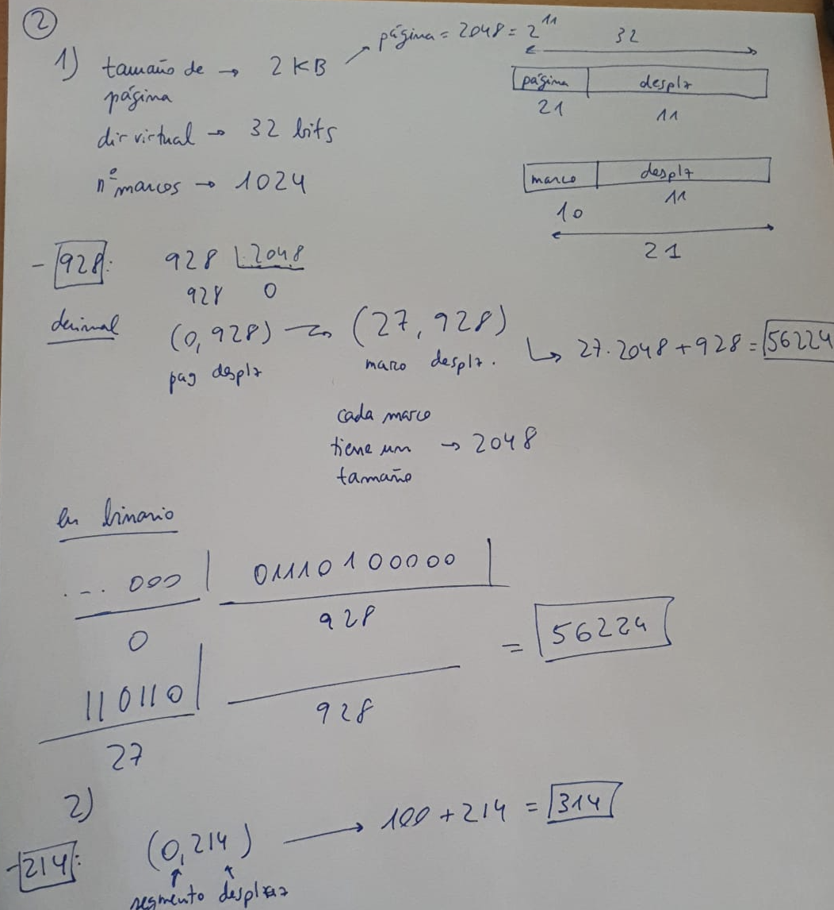

# 25 Marzo 2022
---

NOTA: a mayor tamaño de página, mayor fragmentación interna y menor fragmentación de tabla.
NOTA: Las páginas pequeñas se adecúan mejor al pruncipio de localidad

- En *paginación* el espacio del proceso es un conjunto de espacios continuos.
- En *segmentación* es distinto, un proceso es un conjunto de segmentos pero que no tienes espacios contiguos.

- Segmentation fault -> violación de memoria. En paginación se da al acceder a una dirección más alta que el proceso. (0,721)
- Fallo de segmento -> la dirección está en otro segmento. (3,500)