# Nota para la gente que lea esto:
*Hay muchos conocimientos que ya tengo muy de la mano, por lo que los más básicos o aquellos que ya conozca demasiado simplemente los omitiré y no aparecerán aquí (ej: **no voy a decir lo que es un exploit o un backdoor**). Estos apuntes deberían servir sólo como repaso o recordatorio (hay cosas que pongo meramente para hacer un pequeño esquema). Mirar los apuntes de Redondo antes que los míos.*
# Tema 1 Introducción
- Un sistema informático es seguro cuando responde según lo previsto
	- Permite que los usuarios realicen operaciones para las que tienen acceso y evita que realicen las que no lo tienen. 
	- También garantiza 3 cosas:
		- **Confidencialidad**: los datos solo son **visibles** para sus legítimos propietarios
		- **Integridad**: los datos solo pueden ser **modificados** por sus legítimos propietarios
		- **Disponibilidad**: los datos son siempre **accesibles** para sus legítimos propietarios
- Ataques contra la **CONFIDENCIALIDAD**:
	- **Hardening**: mejora de la seguridad de los sistemas informáticos
	- **Suplantación**: acceso a datos o software restringidos
	- **Sniffing**: acceso a los datos que el objetivo envía y/o recibe
	- Acceso **físico** a un pc
	- Acceso a las copias de seguridad
	- Acceso a datos/software restringido o privado
- Ataques contra la **INTEGRIDAD**:
	- Los mismos que contra la confidencialidad pero no se limitan exclusivamente a a cceder a la información/software
- Ataques contra la **DISPONIBILIDAD**:
	- Saturación
	- Dejar al sistema sin recursos
	- Eliminar o dañar deliberadamente el hardware existente
	- Apagar el sistema

- ¿Qué es un **CVE**?
	- (Common Vulnerabilities and Exposures) es información de vulnerabilidades de seguridad conocidas públicamente de cualquier software

- **Malware**: software para obtener accesos no autorizados (también llamado código malicioso)
	- Efectos comunes:
		- **Causar fallos**: virus, gusanos, troyanos
		- **Robar información personal/privada**: spyware, keyloggers, stealers
		- **Ataques distribuidos/coordinados**: botnets
		- **Insertar anuncios**: adware, hijackers
		- **Extorsión/daño financiero**: ransomware
		- **Otros**: rogue software, rootkits
- Técnicas de evasión del Malware:
	- Identificar su entorno cuando se ejecuta
	- Confundir a los métodos de detección de las herramientas de seguridad
	- Evasión basada en el tiempo
	- Ofuscación de datos internos (**droppers**: el código malicioso real se descarga cuando se ejecuta un programa)
	- Uso de certificados robados de fuentes acreditadas
	- Técnicas de ocultación de información de información (**stegomalware**)

Tipos de malware:
- **Propagadores**:
	- **Virus**: doble propósito, dañar y propagarse
	- **Gusanos**: se replican en un equipo para aumentar el uso de recursos
- **Wabbits**:
	- DDOS: se replica para agotar los recursos o ralentizar (**bombas fork**)
- **Troyano**:
	- Malware disfrazado de software legítimo
- **Robo de información**:
	- **Spyware**: obtiene información sobre individuos. Recopilan datos en segundo plano
	- **Keylogger**: roban información monitorizando pulsaciones de teclado
- **Anuncios molestos / maliciosos:**
	- **Adware**: software que muestra anuncios en navegadores/aplicaciones
	- **Browser hijackers**: bloquean o dificultan el uso del browser 
- **Daño finaciero/extorsión**:
	- Ransomware: bloquean el uso del ordenador y/o sus datos y piden un rescate por ellos (bloqueadores de pantalla)
- **Rootkit**:
	- Software no solicitado y no autorizado que se instala con privilegios de superusuario con el objetivo de robar información o crear una puerta trasera
- **Rogue software**:
	- Programas falsos que afirman implementar funcionalidades que no implementan (antivirus falsos, herramientas de limpieza de malware, optimizadores de SSOO)
- **Crimeware:**
	- Cualquier software especialmente creado para cometer delitos. Pueden replicarse a sí mismos. Se pueden crear para ser vendidos a delicuentes (RaaS - Ransomware as a Service)

¿Qué es el bug bounty?
- Es un trabajo ofrecido por muchas empresas y organizaciones que consiste en compensaciones a cambio de descubrirles vulnerabilidades o reportarles bugs

Redes Ip:
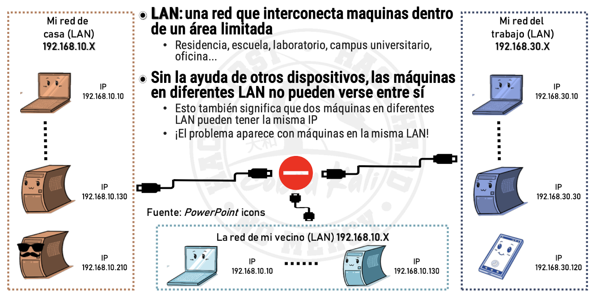

- **CIDR**: es un estándar basado en bits que utiliza prefijos para mostrar direcciones ip con sus propiedades de enrutamiento, es decir, es una forma de representar múltiples IPs con el mismo identificador. Estos grupos se denominan **bloques CIDR**:
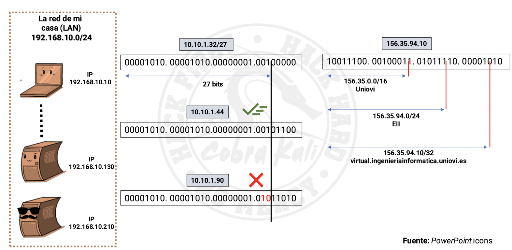

- Las LAN más usadas son la /28 y la /24 (hasta 256 máquinas en la red)
- Los /31 se usan para crear enlaces punto a punto entre dispositivos

- En una red de máquinas puedes comunicarte con todos los dispositivos que tengan una IP compatible con la tuya (dispositivos cuya IP encaja en el mismo CIDR)
- También puedes comunicar máquinas en diferentes redes mediante puentes (bridges) o pasarelas (gateways)
- Normalmente un router asigna una IP privada a cada dispositivo conectado a él y envía todas las conexiones fuera de su LAN privada a través de una IP única. Este mecanismo de traducción se llama NAT.

Diseño típico de una red doméstica:
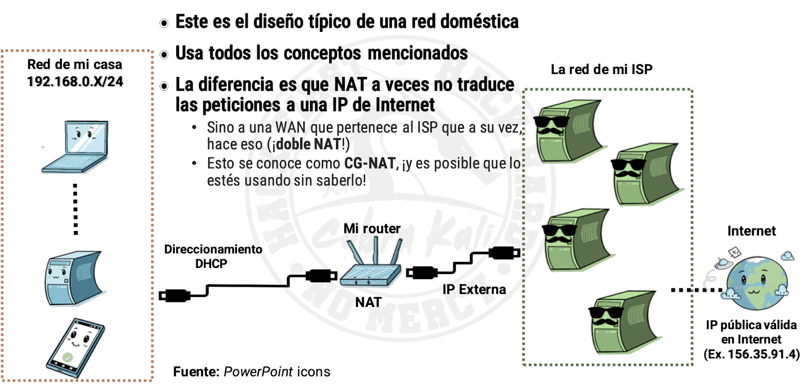
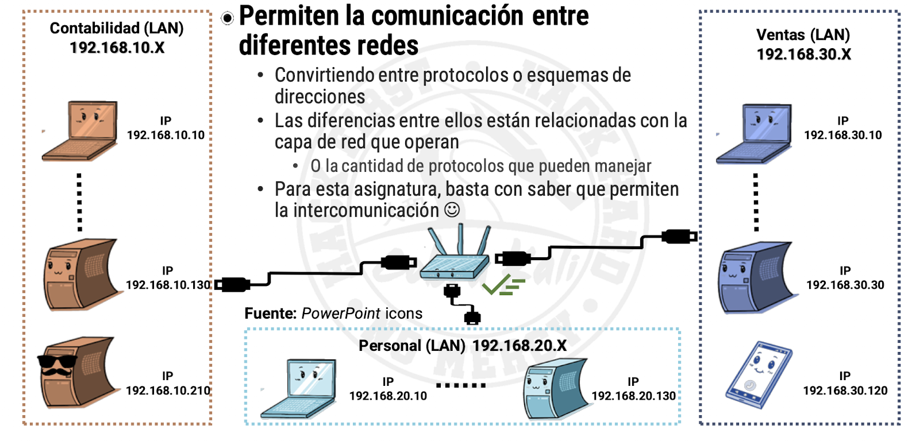

- El servicio DNS traduce IPs en nombres y viceversa
- URL cheat sheet:
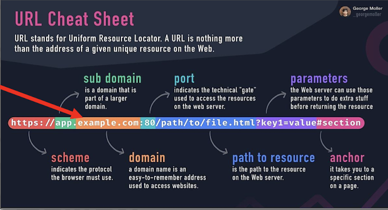
- ¿Cómo funciona un DNS?
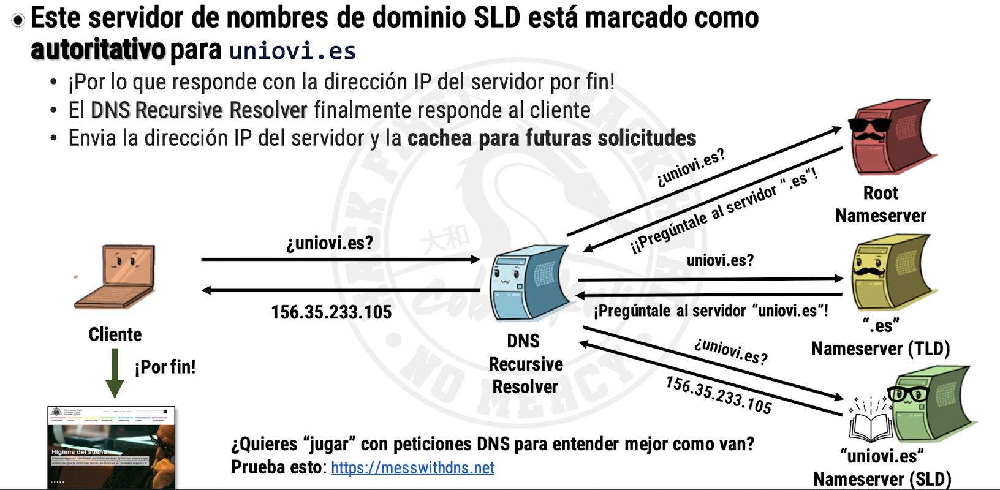

- ¡No se pueden abrir puertos bajo CG-NAT!
- Un mal ejemplo sobre puertos:

¿Qué pasa con las redes WIFI?
- Todos los datos que viajan por tu WIFI podrían ser leídos por la una persona que esté conectada a tu wifi (hay que evitar el wifi gratuito, no me seas *lerdo*, y si lo haces usa un vpn al menos)

- En un sistema operativo normalmente hay estos tipos de cuentas:
	- **Root/Administrador**: admin del sistema
	- **Cuentas del sistema:** con el id de un usuario conocido
	- **Cuentas de servicio**: ejecutan aplicaciones/procesos

- Recuerda que cuando algo es gratuito ¡tus datos son el pago!. No hay duros a 4 pelas. Estos datos posiblemente salgan de tu historial de búsqueda.

- **Hoaxes**: mensajes o publicaciones no deseados con información falsa / sesgada de varios tipos
- **APT** (Advanced Persistent Threat): actores de amenazas ocultos de redes informáticas que obtienen acceso no autorizado a una red y permanecen sin ser detectados durante mucho tiempo
- **OSINT**: conjunto de datos recopilados de fuentes públicas para ser utilizados en el estudio de un objetivo. Es un conjunto de información legalmente accesible

# Tema 2 Criptografía
- **Criptografía:** oculta el **significado** de la información transformándola en una versión no legible (cifrada/encriptada) por medio de algoritmos de encriptación.
- **Esteganografía**: oculta la **existencia** de la información (que está incrustada en otra información distinta). Usarla exclusivamente no es muy aconsejable

- Objetivos de la criptografía:
	- Confidencialidad
	- Integridad
	- Autenticación

- Los **algoritmos de descifrado** son funciones que transforman la información
- Los **algoritmos de cifrado** se pueden clasificar en:
	- **Cifrado por bloques**: IDEA, AES, RSA
	- **Cifrados de flujo**: A5, RC4, SEAL
	- **Cifrados sin clave**: ROT13, ROT47
	- **Cifrados con clave criptográfica** (los más seguros)
		- **Algoritmos de clave simétrica**: el emisor y el receptor comparten la misma clave privada
		- **Algorimtos asimétricos**: el emisor y el receptor tienen dos claves cada uno (una es pública y otra privada)

- Principios de Kerchkoffs (pautas para crear un algoritmo de cifrado basado en claves irrompible)
	- La efectividad no debe depender de que el diseño del algoritmo sea secreto
	- Las claves deben ser fáciles de recordar

¿Los algoritmos con tamaños de clave más grandes son más fuertes que los que usan claves más cortas?
- No, el algoritmo en sí es más importante

**Algoritmo Diffie-Hellman:**
- Establece una clave simétrica entre 2 máquinas para cifrar las comunicaciones
- Pasos:
	- Una máquina elige dos números (p y g) y los envía a otra máquina de manera pública
	- Cada uno elige otro número secreto < p
	- Usando una fórmula matemática cada máquina realiza una serie de operaciones con los números público y secreto
	- Esta es la clave secreta usada para cifrar el mensaje
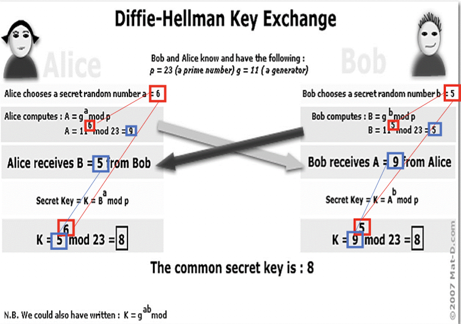

**Aplicaciones prácticas de los algoritmos de clave simétrica: **
- **Cifrado de discos**
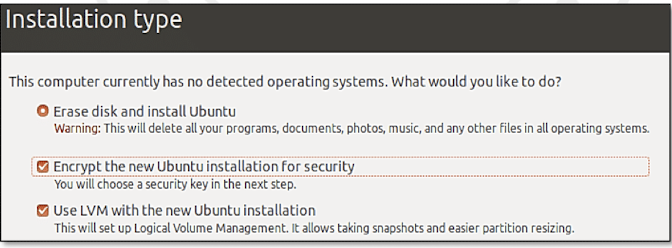
- **Autenticación de plataforma**: 
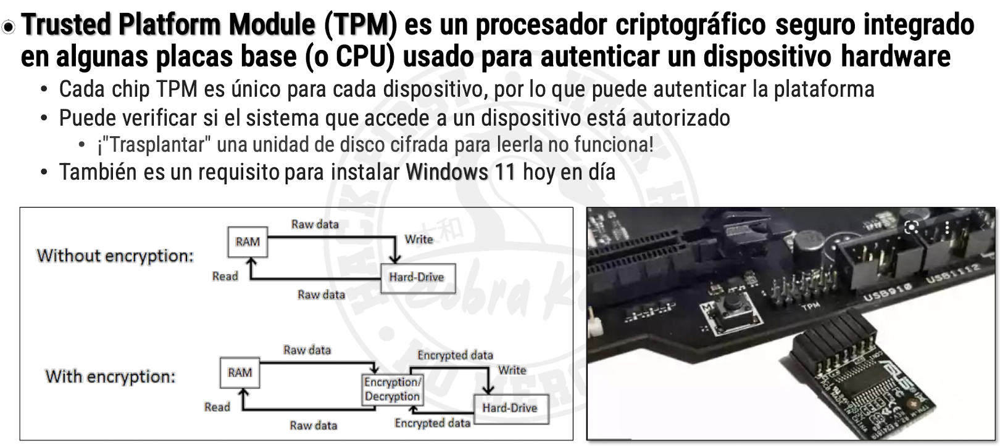
- **Onion routing**: los nodos de Tor intercambian claves simétricas usando Diffie-Hellman:
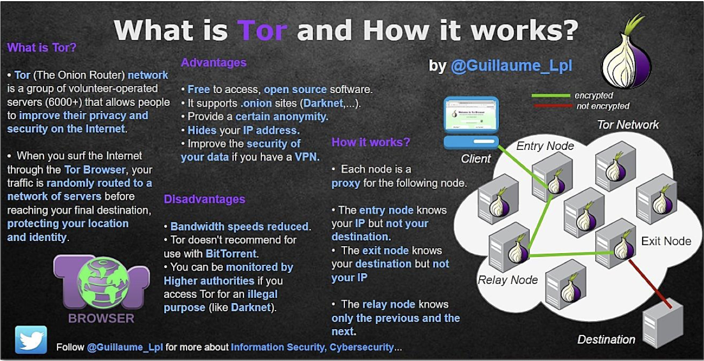

- Algoritmos asimétricos (o de clave pública):
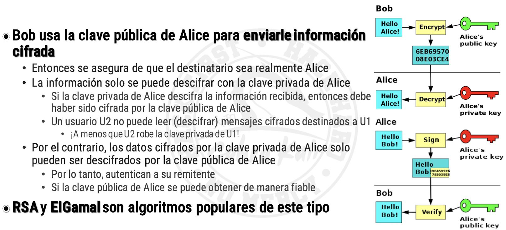

- **GNUPG** es una herramienta de cifrado simétrico / asimétrico y firma digital

- **Aplicaciones prácticas de los algoritmos asimétricos:**
	- Cifrado de archivos y directorios
	- Cifrado de extremo a extremo (WhatsApp)

- Algoritmos de HASH: SHA-1, SHA-3, MD5, BLAKE2

- **Aplicaciones de los algoritmos hash**: aumenta la dificultad de averiguar contraseñas

- Técnicas típicas para adivinar contraseñas a partir de datos almacenados
	- Fuerza bruta pura
	- Diccionarios
	- Tablas rainbow
- Para resistir a estos ataques hay que usar KDF (Key Derivation Function):
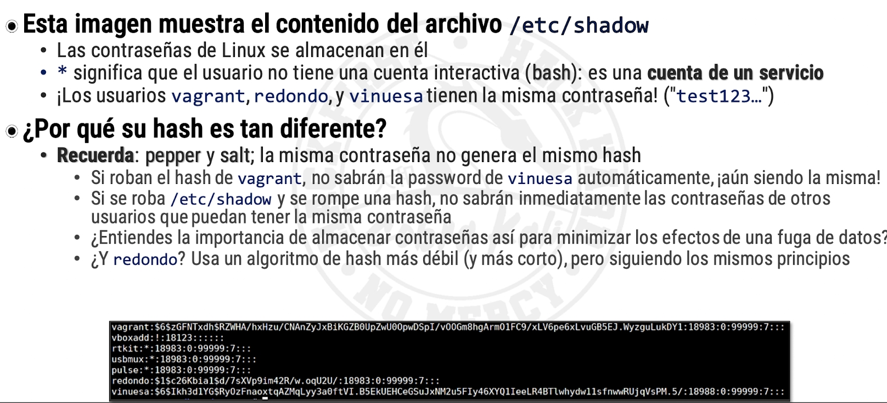

- Firmas digitales: son el resultado de una operación criptográfica que une un documento firmado a un elemento personal, el Certificado Digital. Son el resultado de firmar criptográficamente el hash de un archivo con la clave privada de su autor (las firmas pueden ser .sig o .asc).
- Objetivos de las firmas digitales:
	- Autenticación del origen
	- Integridad
	- No repudiar (el autor no lo puede negar)

- Procedimiento de firma de mensajes:
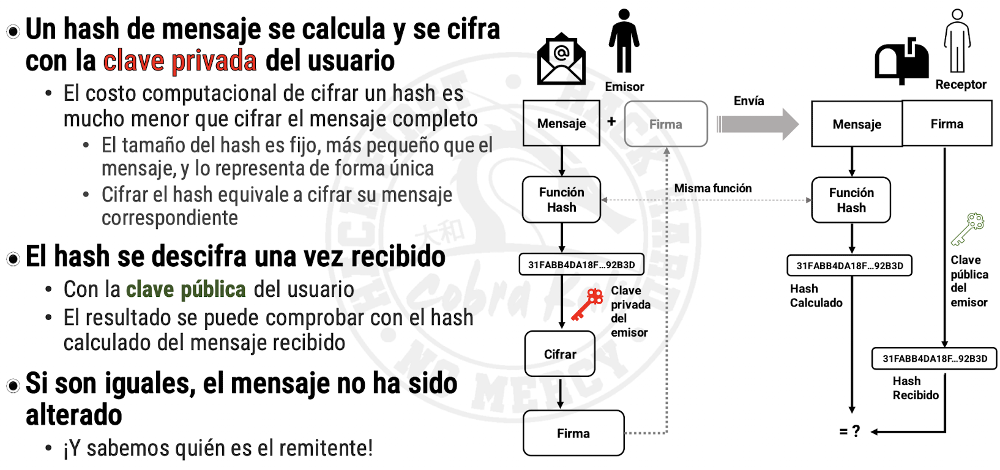
- Cuando se pierde una clave privada, cualquiera que la tenga puede firmar como otra persona o entidad suplantándola.

# Tema 3 Seguridad de sistemas operativos
- El **nivel de seguridad de un sistema** no se obtiene sumando todas las medidas de seguridad implementadas en una organización, sino comprobando el nivel de seguridad del elemento más débil. Estos elementos son: aplicaciones en uso, diseño del software, sistemas operativos y usuarios
- Las **contraseñas de arranque** evitan que usuarios no autorizados con acceso físico al sistema obtengan privilegios de root a través del modo de usuario único/mantenimiento (operaciones peligrosas como cambiar el gestor de arranque, acceso a consola, restablecer la contraseña de root, acceso a SO no seguros...)
- Algunos SO permiten marcar las particiones con propiedades de seguridad (**nodev**, **noexec**, **nosuid**)
- Las ubicaciones de archivos temporales suelen tener permisos de escritura para todo el mundo de forma predeterminada (/var y /tmp). Las aplicaciones maliciosas generalmente escriben en directorios temporales y luego intentan ejecutar lo que escribieron. Por tanto hay que montar  /tmp en una partición separada con las opciones de **nodev**, **nosuid** y **noexec**.
- La mejor opcion contra el software vulnerable es ejecutar menos software.
- Un proceso no puede interactuar con otro que tiene un nivel de integridad (IL) más alto
- La forma más fácil de obtener acceso no autorizado a un sistema Linux es arrancar el servidor en single user mode
- Permisos en Linux:
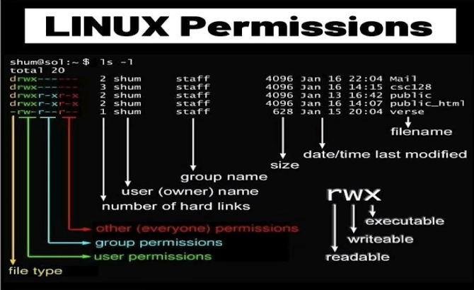

# Tema 4 Políticas de seguridad y hardening automatizado

- Protocolo **SCAP** (Security Content Automation Protocol): protocolo que permite el hardening automatizado en sistemas software -> OpenSCAP es el proyecto más popular
- **STIGs**: listas de controles de seguridad para "mazar" un software. Niveles de gravedad:
	- CAT I: muy grave
	- CAT II: intermedio
	- CAT III: menos grave
- **CIS** benchmarks: fuente bien establecida de guías de hardening
- **Implementation Groups**: son categorías que las propias empresas pueden utilizar para aito-evaluarse su seguridad. Hay tres grupos:
	- IG 1: limitada exposición al riesgo
	- IG 2: exposición al riesgo más elevada
	- IG 3: exposición al riesgo máximo
- **SGSI** (Sistema de Gestión de la Seguridad de la Información): proceso de gestión de la seguridad. Implementar un SGSI significa que la empresa ha:
	- **Estudiado** los riesgos a los que está sometida su información
	- **Evaluado** que nivel de riesgo asume
	- **Implementado** controles
	- **Documentado** las políticas y los procedimientos relacionados
	- Entrado en proceso de **revisión y mejora**
- Fases de implementación de un SGSI:
	- PLAN: crear el plan de seguridad final
	- DO: implementar procedimientos de gestión de riesgos y formación de usuarios
	- CHECK: medir la eficacia de los controles, monitorización y revisión
	- ACT: mantenimiento y mejora del SGSI

---
# Resumen medallitas
# Medallitas Tema 1
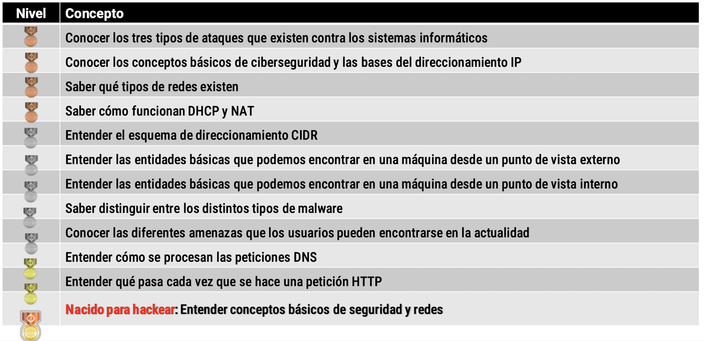
1. Tipos de ataques contra los sistemas informáticos:
- Contra la **confidencialidad**
- Contra la **integridad**
- Contra la **disponibilidad**

2. Tipos de redes existentes
- **LAN**: red que interconecta máquinas dentro de un área limitada
- **CIDR**: Classless Inter-Domain Routing, estándar que usa prefijos para mostrar direcciones ip con sus propiedades de enrutamiento. Forman grupos denominados grupos CIDR

3. Cómo funciona DHCP y NAT
- **DHCP**: Dynamic Host Configuration Protocol, protocolo que asigna direcciones ip de forma automática y dinámica típico de las redes locales
- **NAT**: se envían peticiones que se traducen a IPs de la red de destino, y se reciben respuestas que se traducen a la IP del origen.

4. Cómo funcionan los dns
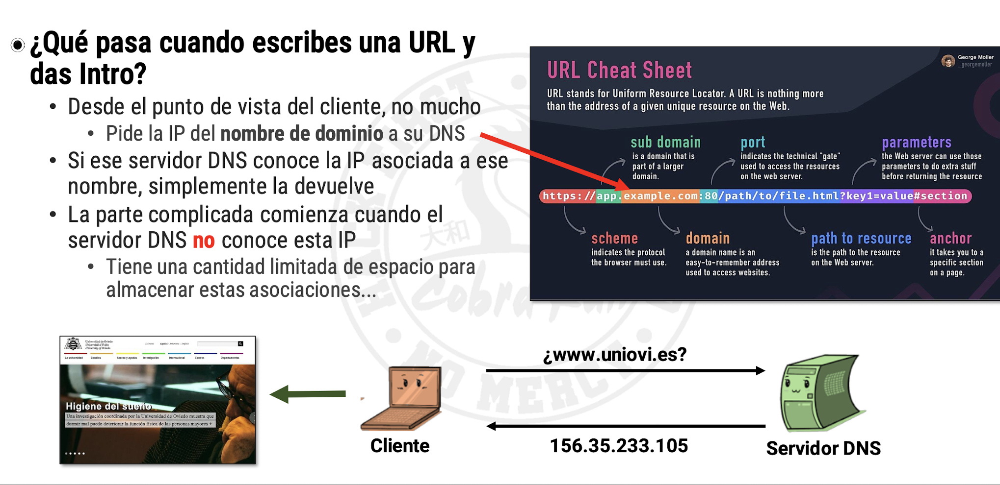
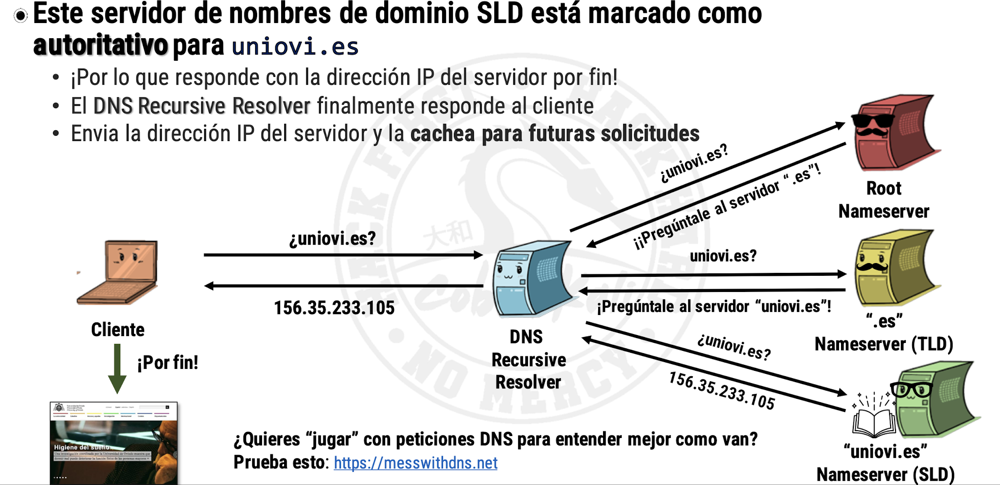

# Medallitas Tema 2
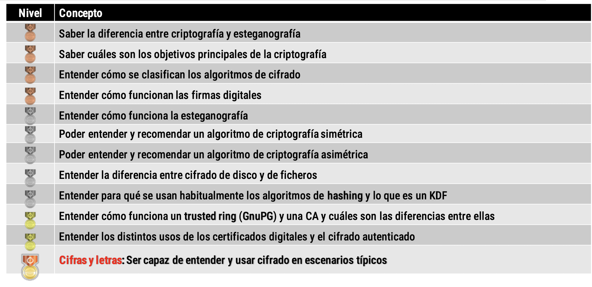

1. Diferencia entre criptografía y esteganografía
- **Criptografía**: ocultar el *significado* de la información
- **Esteganografía**: ocultar la *existencia* de la información

2. Objetivos principales de la criptografía
- **Confidencialidad**: sólo aquellos que conocen el método de descifrado pueden conocer el significado de la información
- **Integridad**: garantía de que los datos no han sido modificados
- **Autenticación**: verificación de que la identidad de los emisores es la que se declara

3. Clasificación de los algoritmos de cifrado
- **Cifrados por bloques**: IDEA, AES, RSA, cifran por bloques
- **Cifrados de flujo**: A5, RC4, SEAL, cifran bit a bit
- **Cifrados sin clave**: ROT13, ROT47, permutan posiciones de unidades de texto
- **Cifrados con clave criptográfica**: 
	- Clave simétrica: AES, IDEA, el emisor y el receptor comparten la misma clave privada
	- Clave asimétrica: el emisor y el receptor tienen dos claves cada uno (una pública para cifrar y una privada para descifrar/autenticar)

4. Para qué se usan habitualmente los algoritmos de hashing y qué es un KDF
- Los algoritmos de hashing (SHA, BLAKE2) se usan para almacenar contraseñas, para huellas digitales, para firmas digitales y para el blockchain.
- En concreto **KDF** (Key Derivation Function, como PBKDF) se usa para almacenar contraseñas de forma que sean verdaderamente resistente a ataques. Usa técnicas "**key streching**" para mejorar la seguridad de los datos almacenados:
	- **Salt** (semilla): datos aleatorios concatenados a las contraseñas de texto sin formato
	- **Iteraciones/rondas**: aplicar una función hash varias veces
- Nota: debido al salt y al pepper l**a misma contraseña en dos equipos distintos nunca será la misma**

# Medallitas Tema 3
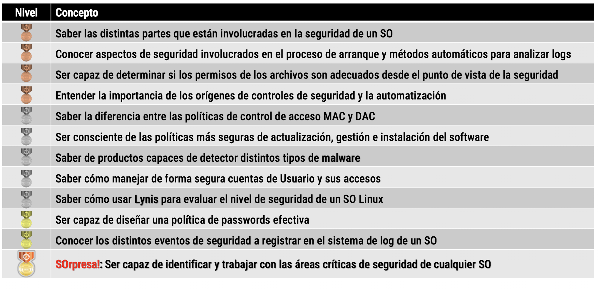

1. Partes involucradas en la seguridad de un sistema operativo
- Los defectos del software
- La homogeneidad en el SO
- La diversidad en el SO
- Diseño inseguro o errores de usuario
- Usuarios y código con privilegios excesivos
- Usuarios

2. Diferencias entre políticas de control de acceso MAC y DAC
- **DAC**: control de acceso discrecional (típicos permisos)
- **MAC**: control de acceso obligatorio

# Medallitas Tema 4
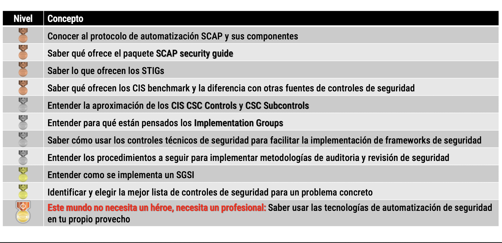

1. Protocolo SCAP y sus componentes
- Protocolo que permite el hardening automatizado en sistemas de software.

2. Qué ofrecen los STIGs
- Son varias comprobaciones para determinar si un dispositivo cumple con el estándar de seguridad que especifica
- A cada una de las comprobaciones de seguridad se le asigna un nivel de gravedad (de más a menos: CAT I, CAT II, CAT III)

3. Ventajas de los CIS
- La principal diferencia con respecto a otros controles de seguridad es el apoyo profesional que recibe, es decir, el sustento por parte de Empresas privadas y gobiernos.

4. Para qué sirven los implementation groups
- Son categorías para que una empresa se evalúe a sí misma su nivel de seguridad
- Cada grupo contiene una serie de subcontroles de seguridad

5. Cómo se implementa un SGSI

---

